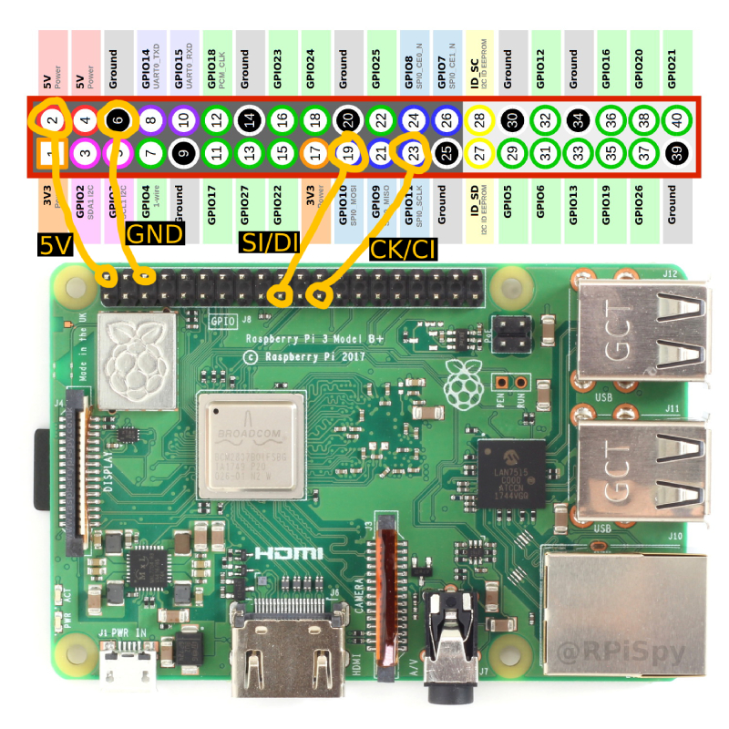

# LED climbing wall

Use LEDs to create custom routes up a climbing wall. This code runs on a Raspberry Pi 3 connected to a chain of WS2801 LEDs. Three deprecated scripts are currently included: 
- climb.py, addSymetricalRoutes.py

New, working scripts are:
- led_test.py - cycles through red, green, blue for each pixel so you can check they are all working properly
- create_mapping.py - use this to create the mapper dictionary needed for set_route.py. This assumes you have labelled the holds on your wall (I recommend using a grid system with letters on the X axis and numbers on the Y axis, but this is not essential), and an LED is placed below each hold. The script will step through the LED string and ask you which hold you see lit up. You input the label for each hold e.g. 'a6' or 'none' and once all LEDs have been illuminated the mapper dictionary is printed to screen which you should copy and paste into set_route.py, replacing the default mapper dictionary. 
- set_route.py - will let you turn pixels on/off, set their color, add a climbing grade and save the route to a database. Currently, LEDs can be set but not saved to the database.
    - NOTE: You will need to edit this script to change the 'mapper' library. Use create_mapping.py which will walk you through creating a mapper dictionary, then output it to the screen. You can copy this then paste it into set_route.py in place of the default mapper dictionary.
    - NOTE2: Line 10 of the script sets PIXEL_COUNT = 32, i.e. it assumes there are 32 LEDs in your string. If you have more (which you probably do) set this number as appropriate.

The following scripts are being worked on and are not fully functional:
- circuit.py - you choose a grade range, the number of climbs you want to do, whether you want to do symetrical versions, and then the routes will be presented via the LEDs and the grade is output to the console along with the progress through the set, the date of setting, and whether it has been completed (e.g. 12 of 20, grade V3, set on 1/1/23, completed = true). The user is invited to press 'e' to edit the route (change the grade), 'f' to mark as failed on the route and load next, or 'space bar' to mark as success and load next.
        - NOTE: Line 10 of the script sets PIXEL_COUNT = 32, i.e. it assumes there are 32 LEDs in your string. If you have more (which you probably do) set this number as appropriate.

The following scripts are planned for the near future:
- remove_routes.py - you enter an LED and all routes using that hold will be removed from the database. This is useful if you are resetting the board.
- edit_routes.py - you enter an LED and all routes using that LED will be presented sequencially, along with their grade, and date of setting. I.e. console output will look like (1 of 32, grade V1, set 1/1/23, completed = true). As with circuit.py, you then get the chance to edit the route (keypress 'e') to change the grade.
- projects.py - present routes that are marked as 'completed = false'. As with circuit.py, you then get the chance to edit the route (keypress 'e') to change the grade, and to mark as 'f' failed or 'space bar' succesfully completed and advance to next route.

## Demonstration

You can see the system in action in this YouTube demo:

## Prerequisites

- Raspberry Pi 3
- WS2801 LEDs chained together (which you should fit into holes below each hold on the climbing wall - not necessary for initial testing)

## Pi Setup

You need to configure the Pi's SPI bus. Open a terminal and type:

    sudo raspi-config

Then select “Advanced Option” > “SPI”. Enable it and exit.

Update and install neccessary packages:

    sudo apt-get update
    sudo apt-get install python-pip -y
    sudo pip install adafruit-ws2801
    sudo apt install sqlite3

## Connecting the LEDS
You need to connect the LEDs to the GPIO pins on your Pi. Ensure your Pi is turned off when making these connections.

Note: Your Pi may not be able to supply enough current via GPIO pin 2 so you might need to connect the 5V wire on your LEDs to an alternative power supply.

| **GPIO pin**  | **LED connection** |
|---------------|--------------------|
| Pin 2 (5V)    | 5V                 |
| Pin 6 (GND)   | GND                |
| Pin 19 (MOSI) | SI / DI            |
| Pin 23 (SCKL) | CK / CI            |

## Test the LEDs

With the lights connected and the Pi setup and powered on, you can now test the lights by opening a terminal, navigating to the LED_climbing_wall directory and running:

    python led_check.py

You should see each pixel ligh in turn, and this will cycle through red, green then blue.

## Add an SQLite database

You will have downloaded an SQLite database within the repository (routesDB.db). Type:

    sqlite3

...and you will enter a command line for this database. Prefix all commands with a dot (.). '.quit' exits the applicaiton, and a good place to start is '.help'.

You will need to create a table that will be used to store the routes. Run the following code from the SQLite command line. 

    CREATE TABLE routes(id INTEGER PRIMARY KEY AUTOINCREMENT, route TEXT, grade INTEGER, authored DATETIME, complete_count INTEGER, fail_count INTEGER);

Then you need to use '.save routesDB.db' to make this persist.

You don't need to interact further with the database as all reads/writes will be handled by the scripts, however, if you need to check the contents of the database (e.g. for debugging) you can use:

    sqlite3 /* to open the command line */
    .open routesDB.db /* to open the database file */
    .tables /* you should see 'routes' assuming you created the table correctly in the step above */
    SELECT * from routes; /* If you have used set_route.py and saved one or more routes, you should see an output like lines like "1|a1,blue;a3,red;a6,green;|1||0|0" */

You might also like to know "PRAGMA table_info(routes);" /* which lists the columns for the table 'routes'

## Configuring for your climbing wall environment

The scripts were written for my climbing wall which has 16 rows of holds, with an alternating number of holds on each column; 12 or 11, giving 138 LEDs in total. Unless you wish to build a wall which matches this configuration you will want to modify the code to match your wall. 

In such cases you will need to:

- Delete all the entries from the SQLite database. 
- Label each hold on your climbing wall (I recommend labelling each row and each column, holds are then identified through this paring e.g. the hold on row A, column 2 is A2)
- Modify the 'allowed_strings' and 'mapper' variables to link each LED to the corresponding hold on your climbing wall. This should be done in the 'climb.py', 'addRoutes.py' and 'addSymetricalRoutes.py' files. 

## Author

**Colin Bone Dodds**   email: colinbonedodds@gmail.com   github: https://github.com/ColinBD

## License

You are free to experiement and use this code as an individual, but you cannot sell or distribute any portion of this code without my express permission. Get in touch if you want to use this commercially.

